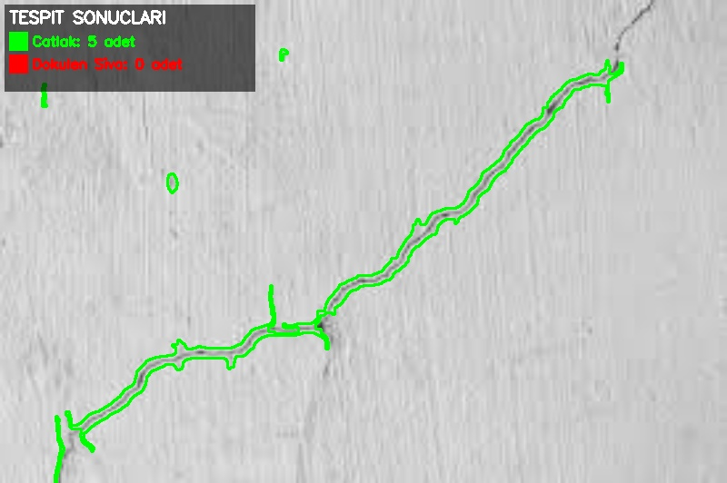

# 🏗️ LifeCoreSen - Bina Duvar ve Kolon Teşhis Sistemi

Bina duvarları ve kolonları üzerindeki **çatlakları** ve **dökülen sıva** parçalarını otomatik olarak tespit eden görüntü işleme uygulaması.

## 📋 Özellikler

- **Çatlak Tespiti**: ORB Feature Detection + Canny Edge Detection kullanarak çatlakları tespit eder
- **Dökülen Sıva Tespiti**: Renk anomalisi, parlaklık değişimi ve kenar analizi ile dökülen sıva bölgelerini bulur
- **Otomatik Filtreleme**: Borular ve düz kenarlar gibi yanlış pozitifler filtrelenir
- **Görsel Raporlama**: Tespit edilen bölgeler renkli olarak işaretlenir

## 🎨 Renk Kodları

| Renk | Anlam |
|------|-------|
| 🟩 Yeşil | Çatlak |
| 🟥 Kırmızı | Dökülen Sıva |

## 📸 Örnek Sonuç

### Orijinal Görüntü


### İşlenmiş Sonuç


## 🚀 Kurulum

```bash
# Repoyu klonla
git clone https://github.com/KULLANICI_ADI/LifeCoreSen.git
cd LifeCoreSen

# Virtual environment oluştur
python -m venv .venv
source .venv/bin/activate  # Linux/Mac
# veya
.venv\Scripts\activate  # Windows

# Bağımlılıkları yükle
pip install -r requirements.txt
```

## 💻 Kullanım

### Resim İşleme
```bash
python Main.py images/image1.jpeg
```


### Sonuçlar
İşlenen resimler `results/` klasörüne `<dosya_adı>_result.jpeg` formatında kaydedilir.


## ⚙️ Konfigürasyon

`config.py` dosyasından tespit parametrelerini ayarlayabilirsiniz:

